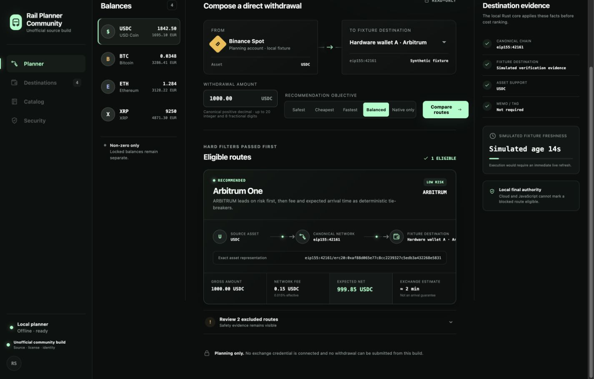

# AssetRail

AssetRail is a local macOS prototype for comparing crypto withdrawal routes
without connecting an exchange account or moving funds.

The current `0.1.x` line is an offline, read-only fixture planner. It uses
deterministic sample balances, destinations, fees, and risk states so developers
can inspect the route-selection and safety model without credentials or live
wallet data.



## Project status

- Platform: macOS 13 or newer; runtime verification currently covers Apple
  silicon. Intel macOS is not claimed as verified.
- Maturity: prototype. The planner is useful for inspecting deterministic route
  decisions, but it is not a live portfolio or withdrawal tool.
- Data mode: bundled synthetic fixtures only.
- Distribution: source and a locally built, ad-hoc-signed community app.
- License: MPL-2.0 for source code and CC-BY-4.0 for original documentation.
- Automation: CI is intentionally outside this repository's current release
  scope. All required checks are documented as local commands.

AssetRail does not connect to Binance, OKX, a wallet, or any hosted AssetRail
service. It cannot place trades, transfer assets, submit withdrawals, persist
accounts, or read credentials through its WebView. Do not enter real exchange
credentials into this version.

## What the prototype demonstrates

- Exact-decimal route arithmetic in a Rust authority.
- Explicit chain and asset representation rather than address-shape inference.
- Hard eligibility filters before recommendation ranking.
- Stable reason codes for excluded routes.
- A connector-neutral snapshot contract with strict IPC validation.
- A Tauri capability boundary with no generic shell, filesystem, HTTP, SQL, or
  credential permission exposed to the main window.
- A separate community identity, bundle identifier, icon, and source disclosure
  for unofficial builds.

The repository also contains security foundations for future read-only
connectors. Those modules are not reachable from the shipping WebView and do
not make the current application live-account-ready.

## Requirements

- macOS 13 or newer
- Xcode command-line tools
- Node.js 24.10.0
- npm 11.6.2
- Rust 1.91.0 with `rustfmt` and `clippy`

The Node and Rust versions are pinned in `.node-version`, `package.json`, and
`rust-toolchain.toml`.

## Quickstart

Install locked dependencies and run the browser development surface:

```bash
npm ci
npm run dev
```

Vite prints the local URL. The browser view is suitable for UI work; native
Tauri IPC and bundle behavior require one of the macOS build paths below.

## Build the macOS app

Build, ad-hoc sign, verify, and launch the owner-controlled development app:

```bash
npm ci
./script/build_and_run.sh --verify
```

The bundle is written to:

```text
src-tauri/target/debug/bundle/macos/AssetRail.app
```

The signature is local ad-hoc signing. It is not a Developer ID signature,
notarization, or Mac App Store package.

### Build an unofficial community app

Community distributions must not inherit AssetRail's official identity:

```bash
npm ci
npm run test:run
npm run build:community
```

The default bundle is:

```text
src-tauri/target/release/bundle/macos/Rail Planner Community.app
```

The build requires a clean Git commit, embeds the exact source revision and
MPL-2.0 status, strips symbols, remaps build paths, rejects workstation-path
leakage, applies a distinct identity, and verifies the resulting ad-hoc seal.
See [the community build guide](docs/open-source/COMMUNITY_BUILD.md) before
distributing a modified build.

## Local verification

Run the public source checks from the repository root:

```bash
npm ci
npm run test:run
npm run test:config
npm run build
npm run verify:security
cargo fmt --manifest-path src-tauri/Cargo.toml --all -- --check
cargo test --manifest-path src-tauri/Cargo.toml --locked --all-targets --all-features
cargo clippy --manifest-path src-tauri/Cargo.toml --locked --all-targets --all-features -- -D warnings
cargo test --manifest-path src-tauri/Cargo.toml --locked --release --all-targets --all-features
npm audit --audit-level=high
cargo audit --file src-tauri/Cargo.lock
```

`cargo audit` requires the separately installed RustSec client. CI is not a
substitute for these commands because CI is deliberately not part of this
release.

## Architecture

The React/TypeScript WebView owns presentation and validates every value that
crosses IPC. Rust owns domain validation, exact-decimal route evaluation,
fixture construction, and security-sensitive connector foundations.

Important boundaries:

- `src/planner/`: browser-side types, decimal handling, fixtures, and IPC
  validation.
- `src-tauri/src/domain.rs`: validated domain values.
- `src-tauri/src/route_engine.rs`: eligibility and route comparison.
- `src-tauri/src/fixtures.rs`: the only snapshot exposed to the current UI.
- `src-tauri/src/security/`: redaction and credential-vault foundations that
  are not exposed to the WebView.
- `schemas/v1/`: connector and evidence contracts.
- `docs/adr/`: architectural decisions and authority boundaries.

The [public/private boundary](docs/open-source/PUBLIC_PRIVATE_BOUNDARY.md),
[fixture provenance](docs/open-source/FIXTURE_PROVENANCE.md), and
[security policy](SECURITY.md) describe the release contract in more detail.

## Privacy and security

The current app has no analytics, telemetry, crash upload, account system,
remote content, generic network permission, or user-data persistence. Synthetic
destination tokens cannot be mistaken for real wallet addresses. See
[PRIVACY.md](PRIVACY.md) for the complete current-data boundary.

Do not report suspected vulnerabilities in a public issue. Use GitHub Private
Vulnerability Reporting or the private fallback described in
[SECURITY.md](SECURITY.md).

## Contributing and support

Read [CONTRIBUTING.md](CONTRIBUTING.md) before opening a pull request. All
contributions require a DCO 1.1 sign-off and must preserve the no-execution,
no-secret fixture boundary. Community behavior is governed by
[CODE_OF_CONDUCT.md](CODE_OF_CONDUCT.md).

Use [GitHub Issues](https://github.com/rsitech-ai/asset-rail/issues) for
reproducible bugs and narrowly scoped feature proposals. See
[SUPPORT.md](SUPPORT.md) for the support boundary.

## License and trademarks

Source code, tests, scripts, schemas, and the community icon are available under
the [Mozilla Public License 2.0](LICENSE). Original documentation is available
under [CC-BY-4.0](LICENSES/CC-BY-4.0.txt). Third-party components retain their
upstream licenses.

The source licenses do not grant rights to the AssetRail or RSI Tech names,
official logos, official application icon, bundle identity, domains, or service
identity. Modified distributions must use their own primary name, artwork,
bundle identifier, credentials, support, and privacy disclosures. See
[TRADEMARKS.md](TRADEMARKS.md).
